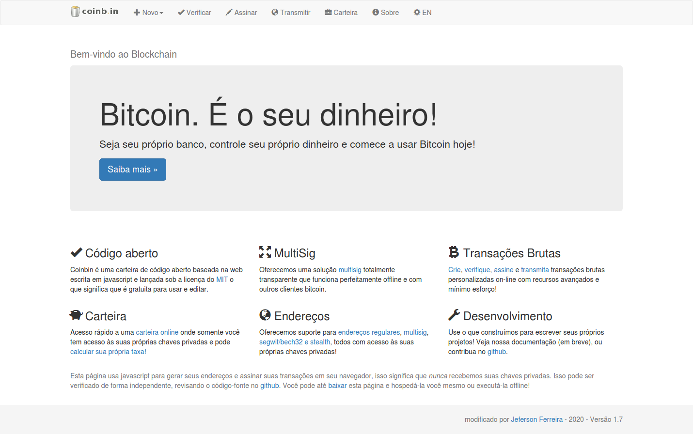

<!-- PROJECT SHIELDS -->
[![Contributors][contributors-shield]][contributors-url]
[![Forks][forks-shield]][forks-url]
[![Stargazers][stars-shield]][stars-url]
[![Issues][issues-shield]][issues-url]
[![MIT License][license-shield]][license-url]
[![LinkedIn][linkedin-shield]][linkedin-url]


<!-- PROJECT LOGO -->
<br />
<p align="center">
  <a href="https://github.com/jeferson0993/coinbin">
    
  </a>

  <h3 align="center">COINB.IN</h3>

  <p align="center">
    carteira bitcoin de código aberto
    <br />
    <br />
    <strong>Me pague um cafézinho</strong><br />
    <i>bc1qk2up2058008rwnh3jkyhhwfg7450nzmrk0ms4j</i>
    <br />
    <i>1PKTbhTEYe78EJUs4i3rkmNCtatNRMmUFb</i>
    <br />
    <br />
    <a href="https://jeferson0993.github.io/coinbin/">Ir ao site</a>
    ·
    <a href="https://github.com/jeferson0993/coinbin/issues">Reportar erro</a>
    ·
    <a href="https://github.com/jeferson0993/coinbin/issues">Solicitar recurso</a>
  </p>
</p>


<!-- TABLE OF CONTENTS -->
<details open="open">
  <summary>Tabela de Conteudos</summary>
  <ol>
    <li>
      <a href="#sobre-o-projeto">Sobre o Projeto</a>
      <ul>
        <li><a href="#construido-com">Construido com</a></li>
      </ul>
    </li>
    <li>
      <a href="#começando">Começando</a>
      <ul>
        <li><a href="#pré-requisitos">Pré-requisitos</a></li>
        <li><a href="#instalação">Instalação</a></li>
      </ul>
    </li>
    <li><a href="#uso">Uso</a></li>
    <li><a href="#roteiro">Roteiro</a></li>
    <li><a href="#contribuindo">Contribuindo</a></li>
    <li><a href="#licença">Licença</a></li>
    <li><a href="#contato">Contato</a></li>
    <li><a href="#reconhecimentos">Reconhecimentos</a></li>
  </ol>
</details>


<!-- Sobre o projeto -->
## Sobre o projeto



Aplicativo da Web Progressivo para o seu dispositivo Celular, Tablet e/ou Computador. Baseado em uma carteira de Bitcoin para navegador de código aberto.

<!-- Construido com -->
### Construido com

Ferramentas e técnologias utilizadas neste projeto:
* [bootstrap](https://getbootstrap.com/)
* [jquery](https://jquery.com/)
* [GitHub Pages](https://pages.github.com)


<!-- Começando -->
## Começando

Para obter uma cópia local do projeto, digite o comando:
  ```
  git clone https://github.com/jeferson0993/coinbin.git
  ```


<!-- Pré-requisitos -->
### Pré-requisitos

Qualquer aparelho computador, tablet e celular com android ou ios, que tenha o navegador google-chrome instalado.


<!-- Instalação -->
### Instalação

1. Acesse o [site](https://jeferson0993.github.io/coinbin/)
2. Clique no botão instalar:


<!-- Uso -->
## Uso

O uso é livre do aplicativo ou do código.


<!-- Roteiro -->
## Roteiro

Consulte os [problemas abertos](https://github.com/jeferson0993/coinbin/issues) para obter uma lista de recursos propostos (e problemas conhecidos).


<!-- Contribuindo -->
## Contribuindo

As contribuições são o que torna a comunidade de código aberto um lugar incrível para aprender, inspirar e criar. Quaisquer contribuições que você fizer são **muito apreciadas**.

1. Fork the Project
2. Create your Feature Branch (`git checkout -b feature/AmazingFeature`)
3. Commit your Changes (`git commit -m 'Add some AmazingFeature'`)
4. Push to the Branch (`git push origin feature/AmazingFeature`)
5. Open a Pull Request


<!-- Licença -->
## Licença

Distribuído sob a licença MIT. Veja a [`LICENÇA`](https://github.com/jeferson0993/coinbin/blob/master/LICENSE) para mais informações.


<!-- Contato -->
## Contato

Jeferson Ferreira - jeferson0993@gmail.com

<!-- Reconhecimentos -->
## Reconhecimentos
[Link para o projeto original](https://github.com/OutCast3k/coinbin/)


<!-- MARKDOWN LINKS & IMAGES -->
<!-- https://www.markdownguide.org/basic-syntax/#reference-style-links -->
[contributors-shield]: https://img.shields.io/github/contributors/jeferson0993/coinbin.svg?style=for-the-badge
[contributors-url]: https://github.com/jeferson0993/coinbin/graphs/contributors
[forks-shield]: https://img.shields.io/github/forks/jeferson0993/coinbin.svg?style=for-the-badge
[forks-url]: https://github.com/jeferson0993/coinbin/network/members
[stars-shield]: https://img.shields.io/github/stars/jeferson0993/coinbin.svg?style=for-the-badge
[stars-url]: https://github.com/jeferson0993/coinbin/stargazers
[issues-shield]: https://img.shields.io/github/issues/jeferson0993/coinbin.svg?style=for-the-badge
[issues-url]: https://github.com/jeferson0993/coinbin/issues
[license-shield]: https://img.shields.io/github/license/jeferson0993/coinbin.svg?style=for-the-badge
[license-url]: https://github.com/jeferson0993/coinbin/blob/master/LICENSE
[linkedin-shield]: https://img.shields.io/badge/-LinkedIn-black.svg?style=for-the-badge&logo=linkedin&colorB=555
[linkedin-url]: https://www.linkedin.com/in/jeferson-ferreira-4a036b143/
[product-screenshot]: screenshot.png
[install-screenshot]: install.png
